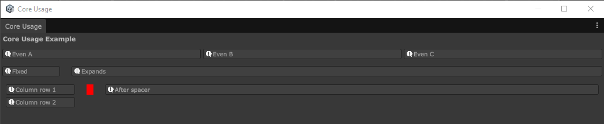

# KarlBanan Editor Layout

KarlBanan Editor Layout is a small Unity editor package for building custom inspector layouts from reusable elements.

This is the **core** package. It contains default layout helpers and base APIs, but it intentionally does not include a large set of ready to use field types. If you want ready to use field types, consider using the package `com.karlbanan.editorlayout.extras`



## Features

- `IInspectorElement` interface for custom drawable inspector elements.
- `EditorDraw.EvenRow` for evenly distributed horizontal rows.
- `EditorDraw.FixedRow` for preferred width horizontal rows.
- `InspectorColumn` for vertical element groups.
- `InspectorSpace` for manual spacing and layout balancing.
- `InspectorField<T>` base class for custom value fields.
- Configurable element sizing, padding, spacing, label placement, and cross-axis alignment.

## Installation

### Instal from Git URL

In Unity:

1. Open **Window > Package Manager**
2. Press **+**
3. Select **Install package from git URL**
4. Enter: 

```txt
https://github.com/ClearKitten/com.karlbanan.editorlayout.git
```

To install a specific version tag:

```txt
https://github.com/ClearKitten/com.karlbanan.editorlayout.git#v1.0.0
```

## Requirements

- Unity 6000.0 or newer

## Basic Usage

Use this pacakge from editor-only code, such as a custom editor or editor window.

```csharp
using UnityEditor;
using UnityEngine;
using KarlBanan.EditorLayout;

public sealed class CoreUsageExampleWindow : EditorWindow
{
    [MenuItem("Tools/KarlBanan/Editor Layout/Core Usage Example")]
    private static void Open()
    {
        GetWindow<CoreUsageExampleWindow>("Core Usage");
    }

    private void OnGUI()
    {
        EditorGUILayout.LabelField("Core Usage Example", EditorStyles.boldLabel);
        EditorGUILayout.Space(4f);

        EditorDraw.EvenRow(
            new ExampleInspectorElement("Even A"),
            new ExampleInspectorElement("Even B"),
            new ExampleInspectorElement("Even C")
        );

        EditorGUILayout.Space(8f);

        EditorDraw.FixedRow(
            LayoutSettings.StretchLastSettings,
            new ExampleInspectorElement("Fixed", 100f, false),
            new ExampleInspectorElement("Expands", 120f, true)
        );

        EditorGUILayout.Space(8f);

        EditorDraw.FixedRow(
            LayoutSettings.Padded,
            new InspectorColumn(
                new LayoutSettings(4f, CrossAxisAlignment.Top),
                new ExampleInspectorElement("Column row 1"),
                new ExampleInspectorElement("Column row 2")
            ),
            new InspectorSpace(12f, debugDraw: true),
            new ExampleInspectorElement("After spacer", 160f, true)
        );
    }
}
```

## Creating a Custom Element

Implement `IInspectorElement` to create something that can be drawn by the layout helpers.

```csharp
using UnityEditor;
using UnityEngine;
using KarlBanan.EditorLayout;

public sealed class ExampleInspectorElement : IInspectorElement
{
    private readonly string text;
    private readonly float preferredWidth;
    private readonly bool expandWidth;

    public ExampleInspectorElement(string text, float preferredWidth = 120f, bool expandWidth = false)
    {
        this.text = text;
        this.preferredWidth = preferredWidth;
        this.expandWidth = expandWidth;
    }

    public bool CanDraw => true;
    public bool ExpandWidth => expandWidth;
    public bool ExpandHeight => false;

    public float GetMinWidth() => 40f;
    public float GetPreferredWidth() => preferredWidth;
    public float GetMinHeight() => EditorGUIUtility.singleLineHeight;
    public float GetPreferredHeight() => EditorGUIUtility.singleLineHeight;

    public void Draw(Rect rect)
    {
        EditorGUI.HelpBox(rect, text, MessageType.Info);
    }
}
```

## Samples

This package includes a **Core Usage Example** sample.

In Unity:

1. Open **Window > Package Manager**
2. Select **KarlBanan Editor Layout**
3. Open **Samples**
4. Import **Core Usage Example**

The sample demonstrates how to create and arrange custom inspector elements without using any extras package field types.

## Package Boundaries

This package is intended to contain only the core layout API.

Suggested package split:

```txt
com.karlbanan.editorlayout          // Core layout API
com.karlbanan.editorlayout.extras   // Optional ready to use fields
```

## Licence

MIT License. See [LICENSE.md](LICENSE.md).